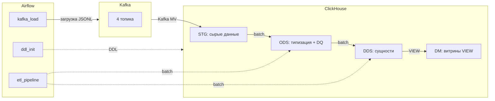

# Учебный стенд DWH кликстрима

[](./docker-compose.yml)
[](./docs/ARCHITECTURE.md)

Живой стек для работы с кликстримом: Kafka, ClickHouse, Airflow, Superset и мониторинг
(Prometheus с Grafana) поднимаются в Docker одной командой. На этом стенде можно учиться
по курсу или просто поднять его у себя и поэкспериментировать с потоковой загрузкой и
витринами.

Поток данных коротко:
- **bootstrap**: `data/*.jsonl → Airflow (kafka_load) → Kafka → ClickHouse (слой STG) →
  Airflow (etl_pipeline: STG → ODS → DDS → DM) → Superset`.
- **steady-stream**: `generator-service → Kafka → ClickHouse (STG) → Airflow (etl_pipeline)
  → Superset`.

## Куда дальше

- **Хочешь учиться** — открой [курс «Кликстрим на ClickHouse»](./docs/course/README.md).
  Это продвинутый курс «со звёздочкой»: основные приёмы инженерии данных проходишь прямо
  на этом стенде.
- **Хочешь поднять и попробовать** — следуй быстрому старту ниже.
- **Хочешь разобраться в устройстве** — смотри [архитектуру слоёв](./docs/ARCHITECTURE.md),
  [запуск и эксплуатацию](./docs/OPERATIONS.md) и [карту репозитория](./docs/REPO_MAP.md).

## Быстрый старт

Стенд управляется через Airflow — это основной рабочий способ. Отдельные shell-скрипты в
`scripts/` оставлены как запасной вариант для локальных прогонов (см.
[OPERATIONS](./docs/OPERATIONS.md)).

```bash
# 1. Поднять весь стек
make up
docker compose ps   # убедиться, что контейнеры запустились
```

Дальше — три шага в Airflow (веб-интерфейс `http://localhost:8080`, логин и пароль
`admin`/`admin`). Сними каждый DAG с паузы (кнопка Unpause) и запусти по очереди:

1. `ddl_init` — создаёт базы, таблицы и представления в ClickHouse.
2. `kafka_load` — заливает события из `data/*.jsonl` в Kafka.
3. `etl_pipeline` — прогоняет цепочку STG → ODS → DDS → DM.

Те же шаги можно запускать из командной строки — это удобно для скриптов:

```bash
docker compose exec -T airflow-webserver airflow dags trigger ddl_init

# Загрузить первые 100 строк каждого файла (limit=0 — загрузить всё)
docker compose exec -T airflow-webserver airflow dags trigger kafka_load \
  --conf '{"limit": 100, "reset_topics": true}'

docker compose exec -T airflow-webserver airflow dags trigger etl_pipeline \
  --conf '{"full_refresh": true}'
```

Проверить, что данные дошли до витрин:

```bash
docker compose exec -T clickhouse clickhouse-client --user=default --password=123456 \
  --query "SELECT count() FROM dm.v_events_enriched"
```

Подробный сценарий запуска, параметры DAG-ов и разбор частых проблем — в
[OPERATIONS](./docs/OPERATIONS.md).

## Сервисы и доступы

| Сервис | Адрес | Назначение | Логин/пароль |
|--------|-------|------------|--------------|
| Airflow | `http://localhost:8080` | оркестрация ETL | admin/admin |
| ClickHouse | `http://localhost:9123/play` | SQL-запросы | default/123456 |
| Kafka UI | `http://localhost:8082` | просмотр топиков | — |
| Superset | `http://localhost:8088` | дашборды | admin/admin |
| Prometheus | `http://localhost:9090` | метрики | — |
| Grafana | `http://localhost:3000` | графики метрик | admin/admin |

Готовый дашборд в Superset:
`http://localhost:8088/superset/dashboard/ecommerce-analytics/` — он создаётся
автоматически через минуту-две после `make up`. Состав и настройка дашборда описаны в
[SUPERSET_DASHBOARD](./docs/SUPERSET_DASHBOARD.md).

## Как устроен поток данных



«Грязные» записи не роняют пайплайн: ошибки разбора складываются в `ods.*_errors` и в
поле `parse_errors`, а обработка продолжается.

Подробное описание слоёв STG/ODS/DDS/DM, диаграммы и обоснование решений —
в [ARCHITECTURE](./docs/ARCHITECTURE.md).

## Документация

- [Архитектура и слои](./docs/ARCHITECTURE.md) — устройство STG/ODS/DDS/DM, диаграммы,
  обоснование решений.
- [Запуск и эксплуатация](./docs/OPERATIONS.md) — сценарий запуска, параметры DAG-ов,
  мониторинг, частые проблемы.
- [Карта репозитория](./docs/REPO_MAP.md) — где какие файлы и что менять.
- [Курс «Кликстрим на ClickHouse»](./docs/course/README.md) — учебная программа на этом
  стенде.
- [DE-task.md](./docs/DE-task.md) — задание, из которого вырос стенд.
