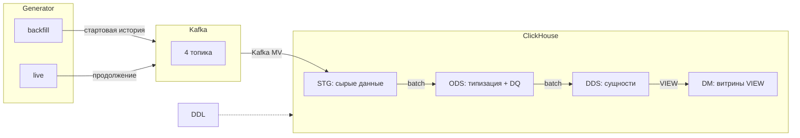

# Учебный стенд DWH кликстрима

[](./docker-compose.yml)
[](./docs/ARCHITECTURE.md)

Живой стек для работы с кликстримом: Kafka, ClickHouse, Airflow, Superset и мониторинг
(Prometheus с Grafana) поднимаются в Docker одной командой. На этом стенде можно учиться
по курсу или просто поднять его у себя и поэкспериментировать с потоковой загрузкой и
витринами.

Поток данных коротко:
- **стартовая история**: `generator backfill → Kafka → ClickHouse (STG) →
  batch STG → ODS → DDS → DM → Superset`.
- **живое продолжение**: `generator live → Kafka → ClickHouse (STG) → batch ETL
  → Superset`.

Файлы `data/*.jsonl` больше не основной источник аналитики. Пока они остаются
архивной кладовкой значений для генератора: браузеры, страны, устройства и UTM.

## Куда дальше

- **Хочешь учиться** — открой [курс «Кликстрим на ClickHouse»](./docs/course/README.md).
  Это продвинутый курс «со звёздочкой»: основные приёмы инженерии данных проходишь прямо
  на этом стенде.
- **Хочешь поднять и попробовать** — следуй быстрому старту ниже.
- **Хочешь разобраться в устройстве** — смотри [архитектуру слоёв](./docs/ARCHITECTURE.md),
  [запуск и эксплуатацию](./docs/OPERATIONS.md) и [карту репозитория](./docs/REPO_MAP.md).

## Быстрый старт

Штатный чистый запуск строит аналитику из стартовой истории генератора. Команда
очищает volumes ClickHouse и Kafka, создаёт стартовую историю, доводит её до DM и
проверяет Superset metadata.

```bash
make generated-history-analytics
docker compose ps
```

По умолчанию это быстрый проверочный профиль на 6 часов модельного времени.
Суточную историю можно прогнать отдельно:

```bash
GEN_MODEL_T_END=2026-01-02T00:00:00+00:00 make generated-history-analytics
```

Повторить только техническую проверку после уже выполненного прогона:

```bash
make generated-history-check
```

Проверить, что данные дошли до витрин:

```bash
docker compose exec -T clickhouse clickhouse-client --user=default --password=123456 \
  --query "SELECT count() FROM dm.v_events_enriched"
```

Подробный сценарий запуска, параметры DAG-ов и разбор частых проблем — в
[OPERATIONS](./docs/OPERATIONS.md).

## Сервисы и доступы

| Сервис | Адрес | Назначение | Логин/пароль |
|--------|-------|------------|--------------|
| Airflow | `http://localhost:8080` | оркестрация ETL | admin/admin |
| ClickHouse | `http://localhost:9123/play` | SQL-запросы | default/123456 |
| Kafka UI | `http://localhost:8082` | просмотр топиков | — |
| Superset | `http://localhost:8088` | дашборды | admin/admin |
| Prometheus | `http://localhost:9090` | метрики | — |
| Grafana | `http://localhost:3000` | графики метрик | admin/admin |

Готовый дашборд в Superset:
`http://localhost:8088/superset/dashboard/ecommerce-analytics/` — он создаётся
во время `make generated-history-analytics`. Состав и настройка дашборда описаны в
[SUPERSET_DASHBOARD](./docs/SUPERSET_DASHBOARD.md).

## Как устроен поток данных



«Грязные» записи не роняют пайплайн: ошибки разбора складываются в `ods.*_errors` и в
поле `parse_errors`, а обработка продолжается.

Подробное описание слоёв STG/ODS/DDS/DM, диаграммы и обоснование решений —
в [ARCHITECTURE](./docs/ARCHITECTURE.md).

## Документация

- [Архитектура и слои](./docs/ARCHITECTURE.md) — устройство STG/ODS/DDS/DM, диаграммы,
  обоснование решений.
- [Запуск и эксплуатация](./docs/OPERATIONS.md) — сценарий запуска, параметры DAG-ов,
  мониторинг, частые проблемы.
- [Карта репозитория](./docs/REPO_MAP.md) — где какие файлы и что менять.
- [Курс «Кликстрим на ClickHouse»](./docs/course/README.md) — учебная программа на этом
  стенде.
- [DE-task.md](./docs/DE-task.md) — задание, из которого вырос стенд.
