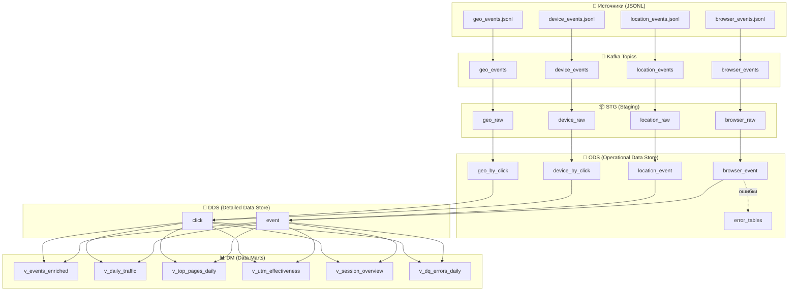
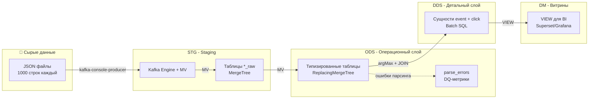
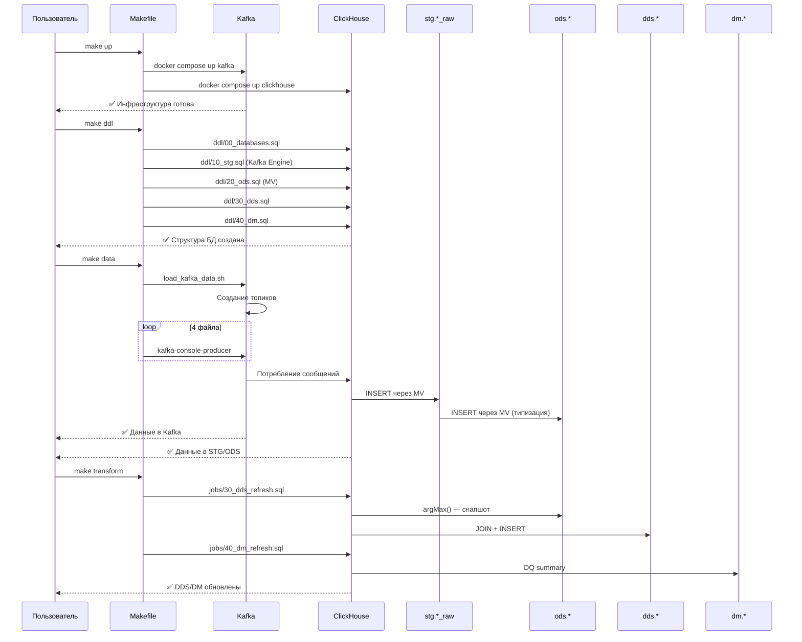
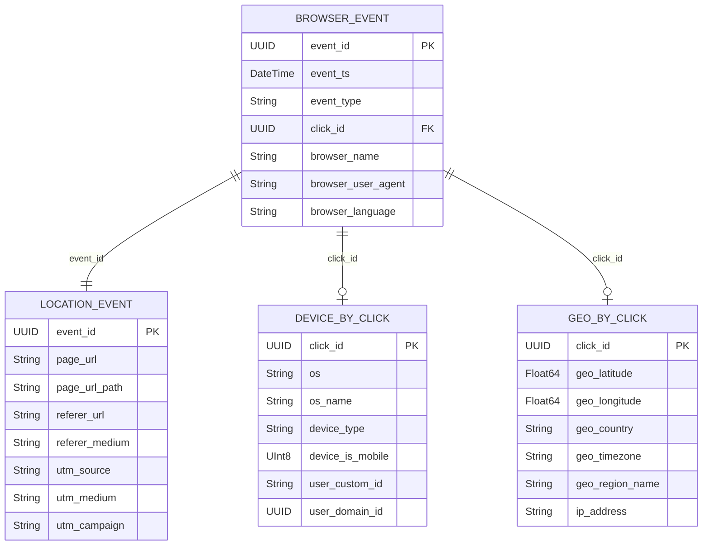
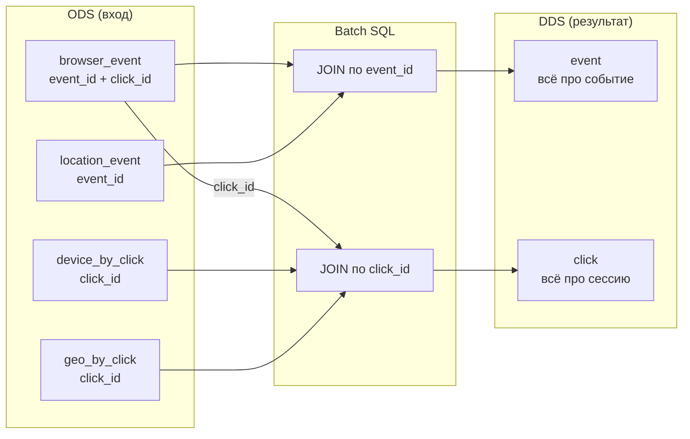

# Архитектура ClickHouse Mini DWH

Подробное описание слоёв хранилища, потоков данных и принятых решений.

---

## Содержание

1. [Обзор архитектуры](#обзор-архитектуры)
2. [Слои хранилища](#слои-хранилища)
   - [STG (Staging)](#stg-staging)
   - [ODS (Operational Data Store)](#ods-operational-data-store)
   - [DDS (Detailed Data Store)](#dds-detailed-data-store)
   - [DM (Data Marts)](#dm-data-marts)
3. [Поток данных](#поток-данных)
4. [Связи ключей](#связи-ключей)
5. [Принятые решения](#принятые-решения)
6. [Масштабирование](#масштабирование)

---

## Обзор архитектуры

### Общая схема потока данных



### Слои и их назначение



---

## Слои хранилища

### STG (Staging)

**Назначение:** Сохранение сырых данных "как есть" для воспроизводимости и отладки.

| Таблица | Движок | Описание |
|---------|--------|----------|
| `browser_raw` | MergeTree | Сырые события браузера |
| `location_raw` | MergeTree | Сырые данные страниц/UTM |
| `device_raw` | MergeTree | Сырые данные устройств |
| `geo_raw` | MergeTree | Сырые гео-данные |
| `kafka_*_raw` | Kafka | Таблицы-источники Kafka |
| `mv_kafka_*_to_stg` | MV | Поток из Kafka в STG |

**Структура таблицы:**
```sql
CREATE TABLE stg.browser_raw (
    ingest_ts DateTime64(3),
    kafka_topic LowCardinality(String),
    kafka_partition Int32,
    kafka_offset Int64,
    kafka_ts DateTime64(3),
    raw String  -- ← JSON как есть
)
```

**Почему так:**
- **Повторяемость**: если в ODS ошибка — можно перестроить без перезагрузки из Kafka
- **Отладка**: видеть "что реально пришло" vs "что распарсилось"
- **DQ**: невалидные JSON не ломают pipeline

---

### ODS (Operational Data Store)

**Назначение:** Типизированные данные с дедупликацией и DQ-метриками.

| Таблица | Ключ | Движок | Описание |
|---------|------|--------|----------|
| `browser_event` | event_id | ReplacingMergeTree(src_ingest_ts) | События браузера |
| `location_event` | event_id | ReplacingMergeTree(src_ingest_ts) | Данные страниц |
| `device_by_click` | click_id | ReplacingMergeTree(src_ingest_ts) | Устройства |
| `geo_by_click` | click_id | ReplacingMergeTree(src_ingest_ts) | Гео-данные |
| `*_errors` | — | MergeTree | Строки с битыми ключами |

**Пример структуры:**
```sql
CREATE TABLE ods.browser_event (
    event_id Nullable(UUID),
    event_ts Nullable(DateTime64(6)),
    event_date Date MATERIALIZED ifNull(toDate(event_ts), toDate(src_ingest_ts)),
    event_type LowCardinality(Nullable(String)),
    click_id Nullable(UUID),
    browser_name LowCardinality(Nullable(String)),
    src_ingest_ts DateTime64(3),
    src_raw String,
    parse_errors Array(LowCardinality(String))
)
ENGINE = ReplacingMergeTree(src_ingest_ts)
ORDER BY (event_id)
SETTINGS allow_nullable_key = 1;
```

**DQ-контроль:**
```sql
-- Проверка ошибок парсинга
SELECT 
    arrayJoin(parse_errors) AS error,
    count() AS cnt
FROM ods.browser_event
GROUP BY error;
```

**Почему так:**
- **Изоляция источников**: изменения в одном не ломают другие
- **Версионирование**: `ReplacingMergeTree` хранит последнюю версию по `src_ingest_ts`
- **Nullable ключи**: `allow_nullable_key = 1` позволяет хранить "битые" строки

---

### DDS (Detailed Data Store)

**Назначение:** Собранные сущности для аналитики.

| Таблица | PK | Источники | JOIN-ключ |
|---------|-----|-----------|-----------|
| `event` | event_id | browser_event + location_event | click_id → click |
| `click` | click_id | device_by_click + geo_by_click | — |

**Структура:**
```sql
CREATE TABLE dds.event (
    event_id UUID,
    event_ts Nullable(DateTime64(6)),
    event_type LowCardinality(Nullable(String)),
    click_id Nullable(UUID),
    page_url Nullable(String),
    page_url_path LowCardinality(Nullable(String)),
    utm_source LowCardinality(Nullable(String)),
    browser_name LowCardinality(Nullable(String)),
    -- ... все поля из browser + location
    dds_update_ts DateTime64(3),
    ods_parse_errors Array(LowCardinality(String))
);

CREATE TABLE dds.click (
    click_id UUID,
    user_domain_id Nullable(UUID),
    device_type LowCardinality(Nullable(String)),
    geo_country LowCardinality(Nullable(String)),
    -- ... все поля из device + geo
    dds_update_ts DateTime64(3),
    ods_parse_errors Array(LowCardinality(String))
);
```

**Загрузка (Batch SQL):**
```sql
-- Снапшот ODS через argMax
INSERT INTO dds.click
SELECT d.click_id, d.user_domain_id, ..., g.geo_country, ...
FROM (
    SELECT click_id, argMax(user_domain_id, src_ingest_ts) AS user_domain_id, ...
    FROM ods.device_by_click
    GROUP BY click_id
) d
LEFT JOIN (
    SELECT click_id, argMax(geo_country, src_ingest_ts) AS geo_country, ...
    FROM ods.geo_by_click
    GROUP BY click_id
) g ON g.click_id = d.click_id;
```

**Почему batch, а не MV:**
- **Согласованность**: MV с JOIN даёт eventual consistency (данные приходят в разное время)
- **Контроль**: Batch SQL можно проверить, откатить, перезапустить
- **Масштабируемость**: легко сделать инкрементальный batch

---

### DM (Data Marts)

**Назначение:** Витрины для BI-инструментов.

| Витрина | Назначение | Гранулярность |
|---------|-----------|---------------|
| `v_events_enriched` | Полное обогащение | 1 строка = 1 событие |
| `v_daily_traffic` | Агрегация трафика | День × страна × устройство × браузер × UTM |
| `v_top_pages_daily` | Популярность страниц | День × URL path |
| `v_utm_effectiveness` | Маркетинговая аналитика | День × UTM source/medium/campaign |
| `v_session_overview` | Сессионная аналитика | День × пользователь × сессия |
| `v_dq_errors_daily` | Мониторинг качества | День × тип ошибки |

**Пример:**
```sql
CREATE VIEW dm.v_events_enriched AS
SELECT
    e.*,
    c.user_domain_id,
    c.device_type,
    c.geo_country,
    arrayConcat(e.ods_parse_errors, c.ods_parse_errors) AS parse_errors
FROM dds.event AS e
LEFT JOIN dds.click AS c ON c.click_id = e.click_id;
```

**Почему VIEW:**
- Для демо: достаточно производительности
- Гибкость: изменения логики не требуют пересоздания таблиц
- Для продакшена: можно материализовать тяжёлые агрегации

---

## Поток данных

### Sequence диаграмма процесса



---

## Связи ключей

### ER-диаграмма



### Сборка DDS-сущностей



**Важно:** Не все `click_id` из events есть в device/geo. Используем `LEFT JOIN`.

---

## Принятые решения

### Почему `allow_nullable_key = 1`?

В ClickHouse ключ сортировки не может быть NULL по умолчанию. Но в "грязных" данных ключи могут отсутствовать.

**Решение:**
1. Включаем `allow_nullable_key = 1` в `ReplacingMergeTree`
2. Фильтруем NULL в MV (`WHERE key IS NOT NULL` → основная таблица)
3. Отдельные `*_errors` таблицы для NULL-ключей

### Почему `ReplacingMergeTree`?

- Дедупликация по бизнес-ключу
- Версионирование по timestamp (последняя версия wins)
- Фоновый merge не блокирует чтение

### Почему batch ODS→DDS?

| Подход | Плюсы | Минусы |
|--------|-------|--------|
| **MV + JOIN** | Реалтайм | Eventual consistency, дубли при late arrival |
| **Batch (выбрано)** | Согласованность, контроль | Задержка до следующего запуска |

---

## Масштабирование

### Инкрементальный batch

Вместо полного `TRUNCATE + INSERT`:

```sql
-- Добавить watermark
INSERT INTO dds.click
SELECT ...
FROM ods.device_by_click
WHERE src_ingest_ts > (
    SELECT max(dds_update_ts) FROM dds.click
);
```

### Материализация витрин

Для тяжёлых агрегаций:

```sql
-- Создать таблицу вместо VIEW
CREATE TABLE dm.daily_traffic AS
SELECT * FROM dm.v_daily_traffic;

-- Пересчёт по расписанию
TRUNCATE TABLE dm.daily_traffic;
INSERT INTO dm.daily_traffic SELECT * FROM dm.v_daily_traffic;
```

### Airflow-оркестрация

```python
# dag.py
with DAG('clickhouse_etl'):
    ddl = BashOperator(task_id='ddl', bash_command='make ddl')
    load = BashOperator(task_id='load', bash_command='make data')
    transform = BashOperator(task_id='transform', bash_command='make transform')
    
    ddl >> load >> transform
```

---

## Полезные запросы

### Проверка слоёв

```sql
-- Статистика по слоям
SELECT 
    database,
    countDistinct(table) AS tables,
    formatReadableQuantity(sum(rows)) AS rows,
    formatReadableSize(sum(bytes)) AS size
FROM system.parts
WHERE database IN ('stg', 'ods', 'dds', 'dm')
GROUP BY database
ORDER BY database;
```

### DQ-анализ

```sql
-- Ошибки парсинга по слоям
SELECT 
    'ods.browser_event' AS table,
    countIf(length(parse_errors) > 0) AS errors,
    count() AS total
FROM ods.browser_event
UNION ALL
SELECT 
    'dds.event',
    countIf(length(ods_parse_errors) > 0),
    count()
FROM dds.event;
```

### Воронка конверсии

```sql
SELECT 
    page_url_path,
    pageviews,
    uniq_clicks,
    round(uniq_clicks * 100.0 / lag(uniq_clicks) OVER (ORDER BY pageviews DESC), 2) AS conversion_pct
FROM dm.v_top_pages_daily
ORDER BY pageviews DESC;
```
