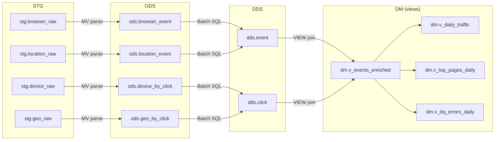

# ClickHouse mini DWH (STG → ODS → DDS → DM) для событий из Kafka (JSON per message)

Набор данных состоит из 4 потоков (предполагаемые Kafka topics):

- `browser_events` — событие (event_id) + время + тип + click_id + браузер
- `location_events` — детализация страницы/UTM (event_id)
- `device_events` — атрибуты устройства/пользователя (click_id)
- `geo_events` — гео/IP (click_id)

Ключи стыковки:

- `event_id` связывает `browser_events` ↔ `location_events`
- `click_id` связывает `browser_events` ↔ (`device_events`, `geo_events`)

Ниже — DDL “по классике”:

- **STG** хранит сырые JSON как есть (1 Kafka message = 1 row) + метаданные доставки.
- **ODS** типизирует поля, добавляет базовую DQ-диагностику, дедуплицирует “последней версией” (ReplacingMergeTree).
- **DDS** собирает “детальные сущности” (событие и click-контекст) и поддерживает дообогащение при опоздавших кусках.
- **DM** — витрины/представления для Superset (enriched view + несколько готовых срезов).

> Примечание про “грязные” данные: в ODS мы используем `…OrNull`-парсинг и заполняем `parse_errors`. Некорректные строки не блокируют пайплайн.

## Как это согласуется с заданием (docx)

В `data/DE-task.md` просят:

- развернуть инфраструктуру, загрузить данные в Kafka и “прогнать” их в ClickHouse по слоям;
- реализовать расчёты/алгоритмы и “регулярный процесс”;
- подготовить агрегаты под дашборд (дашборд сам по себе “не оценивается”).

Эта схема укладывается в задание так:

- **Kafka → STG → ODS** можно сделать полностью внутри ClickHouse через `ENGINE = Kafka` + MV (стриминг, 1 json = 1 row).
- “**регулярный процесс**” — батч‑трансформации `ODS → DDS (→ DM)` в виде SQL (`INSERT INTO … SELECT …`) по расписанию (в будущем Airflow; пока — ручной запуск).
- Airflow (когда появится) можно использовать как **тонкий оркестратор**: применить DDL и запускать batch‑SQL по расписанию.

### Выбранное решение (MVP)

Чтобы сделать “хорошо, но без оверинжиниринга”, фиксируем такое MVP:

- **STG → ODS** — инкрементально через MV (парсинг/типизация рядом с ingest).
- **DDS** — батч‑сборка из ODS через SQL (`INSERT INTO … SELECT …`) как “регулярный процесс”.
  - Причина: `MV + JOIN` в `ODS → DDS` плохо переносит произвольный порядок прихода данных и может давать некорректные результаты (eventual consistency ODS, версии в разных партициях и т.п.).
- **DM** — `VIEW` (витрины “на чтении”) поверх DDS, чтобы не плодить лишние таблицы и джобы под демо.
- На стороне BI считаем, что запросы всегда идут с фильтрами по времени (`event_date`/`event_ts`) и не сканируют всю историю.

Диаграмма витрин и потоков данных:



### Почему DDS батчами (а не MV join)

Мы сознательно уходим от `MV + JOIN` в `ODS → DDS`, потому что это решение:

- чувствительно к произвольному порядку прихода сообщений между топиками;
- может давать неконсистентные “снимки” из‑за версионирования в `ReplacingMergeTree` и отсутствия гарантий “последней версии” в момент выполнения MV;
- может порождать дубли, если одна и та же сущность попадает в разные партиции (например, когда часть полей для партиционирования появляется “позже”).

Поэтому DDS считаем батчами: сначала получаем “current snapshot” ODS (например, через `argMax(..., src_ingest_ts)` по ключу), потом делаем join и грузим результат в DDS.

Дальше, при росте нагрузки:

- делаем инкрементальные батчи по watermark/окнам (а не full rebuild);
- материализуем самые тяжёлые витрины в `DM` (daily/topN), чтобы BI не джойнил “деталь” на лету;
- вводим ресурсные лимиты для BI-пользователя ClickHouse (time/memory/rows), чтобы Superset не “утопил” БД.

---

## План актуализации DDL (target state репозитория)

Цель: перестать исполнять DDL из markdown и хранить **исполняемые** DDL в отдельных `ddl/*.sql` (по слоям), чтобы:

- применять их “тонким раннером” через `clickhouse-client` (через `make ddl`);
- в будущем легко перенести выполнение в Airflow (1 файл = 1 task, линейные зависимости).

Важно: Kafka-объекты STG включаем **по умолчанию** (как часть `ddl/10_stg.sql`).

### Артефакты DDL (планируемые файлы)

- `ddl/00_databases.sql` — базы `stg/ods/dds/dm`.
- `ddl/10_stg.sql` — STG raw (`stg.*_raw`) + Kafka source tables (`ENGINE = Kafka`) + MV `Kafka → STG`.
- `ddl/20_ods.sql` — ODS таблицы типизации + DQ (`parse_errors`) + MV `STG → ODS` + таблицы `ods_*_errors` для строк с битыми ключами.
- `ddl/30_dds.sql` — DDS таблицы (`dds.event`, `dds.click`) **без MV** (только `CREATE TABLE`).
- `ddl/40_dm.sql` — витрины `VIEW` для Superset (`dm.v_*`).

BI-ограничения (ресурсы/пользователь) **не выносим в `ddl/*.sql`**: оставляем это только как текст/пример в этом плане, чтобы не смешивать инфраструктуру доступа с DDL витрин.

### Артефакты batch-трансформаций (планируемые файлы)

- `jobs/30_dds_refresh.sql` — регулярная батч‑сборка DDS из ODS:
  - получить “последнюю версию” строк по ключам (`event_id`/`click_id`) через `argMax(..., src_ingest_ts)` (или эквивалент);
  - выполнить join snapshot’ов и загрузить в `dds.event`/`dds.click` (для демо возможно “full rebuild”; позже — инкрементально).

### Исполнение DDL (make сейчас / Airflow потом)

Требования к файлам `ddl/*.sql`:

- идемпотентность (`IF NOT EXISTS`), чтобы повторные прогоны были безопасны;
- строгий порядок исполнения: `00 → 10 → 20 → 30 → 40` (из‑за зависимостей MV);
- единые имена топиков Kafka: `browser_events`, `location_events`, `device_events`, `geo_events` (их создаёт `make data`).

### Дедупликация и обработка “битых” ключей (ODS)

Проблема: данные “грязные”, а ключи стыковки (`event_id`, `click_id`) могут быть `NULL`/невалидными. Если хранить такие строки в основной ODS‑таблице на `ReplacingMergeTree` с `ORDER BY (event_id/click_id)`, то строки с `NULL` ключом могут схлопываться друг с другом на мерджах, и мы потеряем часть ошибок.

Решение в target state:

- основная ODS (`ods.browser_event`, `ods.location_event`, `ods.device_by_click`, `ods.geo_by_click`) хранит только строки с валидными ключами (key `IS NOT NULL`) и подходит для join’ов/сборки DDS;
- отдельные таблицы `ods.*_errors` хранят строки с битыми ключами (и/или критичными ошибками парсинга) для DQ‑аналитики и дебага; в них важно сохранять “уникальность строки” через Kafka‑метаданные (`kafka_topic/partition/offset`, `kafka_ts`) + `src_ingest_ts` + `raw`.

Про дедуп:

- STG хранит все сообщения как есть; при чтении из Kafka уникальность сообщения определяется `(kafka_topic, kafka_partition, kafka_offset)`.
- В основной ODS дедупликация — по бизнес‑ключу (`event_id` / `click_id`) с версией `src_ingest_ts` (ReplacingMergeTree).
- Для `ods.*_errors` дедуп/уникальность (если потребуется) делаем по Kafka‑метаданным; но в демо допустимо хранить “как пришло” без схлопывания.

Текущее “как запускаем” (целевое, для реализации следующим шагом):

- `make ddl` вызывает `scripts/apply_clickhouse_ddl.sh`;
- скрипт прогоняет `ddl/*.sql` по порядку через `clickhouse-client --multiquery` внутри контейнера ClickHouse.

Batch‑трансформации (целевое, для реализации следующим шагом):

- `make transform` (или аналогичная команда) запускает `jobs/30_dds_refresh.sql` через `clickhouse-client`;
- в будущем Airflow будет делать то же самое по расписанию (один job‑SQL = один task).

### Параметры окружения (docker compose)

- Kafka для подключений **из контейнера ClickHouse**: `kafka:29092` (а `localhost:9092` — только для клиентов на хосте).
- ClickHouse порты на хосте: native `localhost:8002`, HTTP `localhost:9123` (см. `docker-compose.yml`).
- Пользователь ClickHouse: `default`, пароль задан в `configs/default_user.xml` (сейчас `123456`).

---

## Приложение A: текущий inline DDL (legacy; будет вынесен в `ddl/*.sql`)

### 0) Базы данных

```sql
CREATE DATABASE IF NOT EXISTS stg;
CREATE DATABASE IF NOT EXISTS ods;
CREATE DATABASE IF NOT EXISTS dds;
CREATE DATABASE IF NOT EXISTS dm;
```

---

### 1) STG — сырой JSON (+ метаданные доставки)

STG-таблицы делаем максимально простыми и “дешевыми”: строка JSON + время приёма + (опционально) Kafka-метаданные.

```sql
CREATE TABLE IF NOT EXISTS stg.browser_raw
(
    ingest_ts      DateTime64(3) DEFAULT now64(3),
    kafka_topic    LowCardinality(String) DEFAULT '',
    kafka_partition Int32 DEFAULT -1,
    kafka_offset   Int64 DEFAULT -1,
    kafka_ts       DateTime64(3) DEFAULT ingest_ts,
    raw            String
)
ENGINE = MergeTree
PARTITION BY toYYYYMM(ingest_ts)
ORDER BY (kafka_topic, kafka_partition, kafka_offset, ingest_ts);

CREATE TABLE IF NOT EXISTS stg.location_raw
(
    ingest_ts      DateTime64(3) DEFAULT now64(3),
    kafka_topic    LowCardinality(String) DEFAULT '',
    kafka_partition Int32 DEFAULT -1,
    kafka_offset   Int64 DEFAULT -1,
    kafka_ts       DateTime64(3) DEFAULT ingest_ts,
    raw            String
)
ENGINE = MergeTree
PARTITION BY toYYYYMM(ingest_ts)
ORDER BY (kafka_topic, kafka_partition, kafka_offset, ingest_ts);

CREATE TABLE IF NOT EXISTS stg.device_raw
(
    ingest_ts      DateTime64(3) DEFAULT now64(3),
    kafka_topic    LowCardinality(String) DEFAULT '',
    kafka_partition Int32 DEFAULT -1,
    kafka_offset   Int64 DEFAULT -1,
    kafka_ts       DateTime64(3) DEFAULT ingest_ts,
    raw            String
)
ENGINE = MergeTree
PARTITION BY toYYYYMM(ingest_ts)
ORDER BY (kafka_topic, kafka_partition, kafka_offset, ingest_ts);

CREATE TABLE IF NOT EXISTS stg.geo_raw
(
    ingest_ts      DateTime64(3) DEFAULT now64(3),
    kafka_topic    LowCardinality(String) DEFAULT '',
    kafka_partition Int32 DEFAULT -1,
    kafka_offset   Int64 DEFAULT -1,
    kafka_ts       DateTime64(3) DEFAULT ingest_ts,
    raw            String
)
ENGINE = MergeTree
PARTITION BY toYYYYMM(ingest_ts)
ORDER BY (kafka_topic, kafka_partition, kafka_offset, ingest_ts);
```

### (Опционально) Kafka-таблицы-источники

Если ClickHouse читает Kafka напрямую, обычно создают `ENGINE = Kafka` и Materialized View в STG.

Вариант A (предпочтительно): формат `JSONAsString` (если доступен в вашей версии) — читает весь JSON объект в `raw`.

```sql
-- Пример: одна колонка raw, один message = одна строка.
-- Замените broker/topic/group под вашу инфраструктуру.
-- Если ClickHouse запущен в docker compose в одной сети с Kafka — обычно это `kafka:29092`.
-- Если ClickHouse подключается к Kafka с хоста — обычно это `localhost:9092`.
CREATE TABLE IF NOT EXISTS stg.kafka_browser_raw
(
    raw String
)
ENGINE = Kafka
SETTINGS
    kafka_broker_list = 'kafka:29092',
    kafka_topic_list = 'browser_events',
    kafka_group_name = 'ch_stg_browser',
    kafka_format = 'JSONAsString',
    kafka_num_consumers = 1,
    kafka_handle_error_mode = 'stream';

CREATE MATERIALIZED VIEW IF NOT EXISTS stg.mv_kafka_browser_to_stg
TO stg.browser_raw
AS
SELECT
    now64(3) AS ingest_ts,
    _topic AS kafka_topic,
    _partition AS kafka_partition,
    _offset AS kafka_offset,
    toDateTime64(_timestamp_ms / 1000.0, 3) AS kafka_ts,
    raw
FROM stg.kafka_browser_raw;
```

По аналогии для остальных топиков:

```sql
CREATE TABLE IF NOT EXISTS stg.kafka_location_raw (raw String)
ENGINE = Kafka
SETTINGS
    kafka_broker_list = 'kafka:29092',
    kafka_topic_list = 'location_events',
    kafka_group_name = 'ch_stg_location',
    kafka_format = 'JSONAsString',
    kafka_num_consumers = 1,
    kafka_handle_error_mode = 'stream';

CREATE TABLE IF NOT EXISTS stg.kafka_device_raw (raw String)
ENGINE = Kafka
SETTINGS
    kafka_broker_list = 'kafka:29092',
    kafka_topic_list = 'device_events',
    kafka_group_name = 'ch_stg_device',
    kafka_format = 'JSONAsString',
    kafka_num_consumers = 1,
    kafka_handle_error_mode = 'stream';

CREATE TABLE IF NOT EXISTS stg.kafka_geo_raw (raw String)
ENGINE = Kafka
SETTINGS
    kafka_broker_list = 'kafka:29092',
    kafka_topic_list = 'geo_events',
    kafka_group_name = 'ch_stg_geo',
    kafka_format = 'JSONAsString',
    kafka_num_consumers = 1,
    kafka_handle_error_mode = 'stream';

CREATE MATERIALIZED VIEW IF NOT EXISTS stg.mv_kafka_location_to_stg
TO stg.location_raw
AS
SELECT
    now64(3) AS ingest_ts,
    _topic AS kafka_topic,
    _partition AS kafka_partition,
    _offset AS kafka_offset,
    toDateTime64(_timestamp_ms / 1000.0, 3) AS kafka_ts,
    raw
FROM stg.kafka_location_raw;

CREATE MATERIALIZED VIEW IF NOT EXISTS stg.mv_kafka_device_to_stg
TO stg.device_raw
AS
SELECT
    now64(3) AS ingest_ts,
    _topic AS kafka_topic,
    _partition AS kafka_partition,
    _offset AS kafka_offset,
    toDateTime64(_timestamp_ms / 1000.0, 3) AS kafka_ts,
    raw
FROM stg.kafka_device_raw;

CREATE MATERIALIZED VIEW IF NOT EXISTS stg.mv_kafka_geo_to_stg
TO stg.geo_raw
AS
SELECT
    now64(3) AS ingest_ts,
    _topic AS kafka_topic,
    _partition AS kafka_partition,
    _offset AS kafka_offset,
    toDateTime64(_timestamp_ms / 1000.0, 3) AS kafka_ts,
    raw
FROM stg.kafka_geo_raw;
```

> Почему сырой `raw String` в STG полезен для задания: так можно сохранять “грязные” и даже невалидные JSON как есть (в STG), а ошибки парсинга фиксировать уже в ODS (`parse_errors`) без падения потребления Kafka.

> Если `JSONAsString` недоступен в вашей версии ClickHouse, чаще всего можно заменить на `kafka_format = 'RawBLOB'` (просто сообщение как строка байтов). Альтернатива — читать `JSONEachRow` сразу в колонки, но тогда вы хуже сохраняете “как пришло” и сложнее разбирать ошибки.

### Операционка: как проверить, что Kafka-консьюмеры живы

1) Убедиться, что Kafka-таблицы существуют и читаются:

```sql
SHOW TABLES FROM stg LIKE 'kafka_%';
```

2) Посмотреть состояние консьюмеров (названия/колонки зависят от версии ClickHouse, поэтому сначала можно посмотреть схему):

```sql
DESCRIBE TABLE system.kafka_consumers;

SELECT *
FROM system.kafka_consumers
WHERE database = 'stg'
ORDER BY table, consumer_id
LIMIT 50;
```

3) Самый простой smoke-test без системных таблиц — растут ли STG/ODS:

```sql
SELECT count() AS rows, max(kafka_ts) AS max_kafka_ts
FROM stg.browser_raw;

SELECT count() AS rows, max(src_ingest_ts) AS max_ingest
FROM ods.browser_event;
```

> Практика: для “параллелизма” увеличивайте `kafka_num_consumers` и/или число партиций топика. Для демо обычно достаточно `1`.

### Предохранители для BI (Superset), чтобы не “утопить” БД

Для тестового достаточно ограничить ресурсы для BI-пользователя. Пример (пароль/сеть/имена подставьте свои):

```sql
CREATE USER IF NOT EXISTS superset IDENTIFIED WITH sha256_password BY 'REPLACE_ME';
CREATE ROLE IF NOT EXISTS bi_readonly;

GRANT SELECT ON dm.* TO bi_readonly;
GRANT SELECT ON dds.* TO bi_readonly;
GRANT bi_readonly TO superset;

CREATE SETTINGS PROFILE IF NOT EXISTS superset_profile SETTINGS
    max_execution_time = 30,
    max_threads = 4,
    max_memory_usage = 4000000000,
    max_rows_to_read = 200000000,
    max_bytes_to_read = 5000000000,
    max_result_rows = 200000,
    result_overflow_mode = 'break';

ALTER USER superset SETTINGS PROFILE superset_profile;
```

---

### 2) ODS — типизация + дедупликация + DQ

Принцип: на выходе ODS — “как в источнике, но типизировано и пригодно для джойнов”.
Дедупликация — по бизнес-ключу (`event_id` или `click_id`) с версией `src_ingest_ts`.

### 2.1 ODS: browser_events

```sql
CREATE TABLE IF NOT EXISTS ods.browser_event
(
    event_id          Nullable(UUID),
    event_ts          Nullable(DateTime64(6)),
    event_date        Date MATERIALIZED ifNull(toDate(event_ts), toDate(src_ingest_ts)),
    event_type        LowCardinality(Nullable(String)),
    click_id          Nullable(UUID),
    browser_name      LowCardinality(Nullable(String)),
    browser_user_agent Nullable(String),
    browser_language  LowCardinality(Nullable(String)),

    src_ingest_ts     DateTime64(3),
    src_raw           String,
    parse_errors      Array(LowCardinality(String))
)
ENGINE = ReplacingMergeTree(src_ingest_ts)
PARTITION BY toYYYYMM(event_date)
ORDER BY (event_id);

CREATE MATERIALIZED VIEW IF NOT EXISTS stg.mv_browser_raw_to_ods_browser_event
TO ods.browser_event
AS
WITH
    toUUIDOrNull(JSONExtractString(raw, 'event_id')) AS event_id,
    parseDateTime64BestEffortOrNull(JSONExtractString(raw, 'event_timestamp'), 6) AS event_ts,
    JSONExtractString(raw, 'event_type') AS event_type,
    toUUIDOrNull(JSONExtractString(raw, 'click_id')) AS click_id,
    JSONExtractString(raw, 'browser_name') AS browser_name,
    JSONExtractString(raw, 'browser_user_agent') AS browser_user_agent,
    JSONExtractString(raw, 'browser_language') AS browser_language
SELECT
    event_id,
    event_ts,
    event_type,
    click_id,
    browser_name,
    browser_user_agent,
    browser_language,
    ingest_ts AS src_ingest_ts,
    raw AS src_raw,
    arrayFilter(x -> x != '', [
        if(event_id IS NULL, 'bad_event_id', ''),
        if(event_ts IS NULL, 'bad_event_timestamp', ''),
        if(click_id IS NULL, 'bad_click_id', '')
    ]) AS parse_errors
FROM stg.browser_raw;
```

### 2.2 ODS: location_events

```sql
CREATE TABLE IF NOT EXISTS ods.location_event
(
    event_id        Nullable(UUID),

    page_url        Nullable(String),
    page_url_path   LowCardinality(Nullable(String)),
    referer_url     Nullable(String),
    referer_medium  LowCardinality(Nullable(String)),
    utm_medium      LowCardinality(Nullable(String)),
    utm_source      LowCardinality(Nullable(String)),
    utm_content     LowCardinality(Nullable(String)),
    utm_campaign    LowCardinality(Nullable(String)),

    src_ingest_ts   DateTime64(3),
    src_raw         String,
    parse_errors    Array(LowCardinality(String))
)
ENGINE = ReplacingMergeTree(src_ingest_ts)
PARTITION BY toYYYYMM(toDate(src_ingest_ts))
ORDER BY (event_id);

CREATE MATERIALIZED VIEW IF NOT EXISTS stg.mv_location_raw_to_ods_location_event
TO ods.location_event
AS
WITH
    toUUIDOrNull(JSONExtractString(raw, 'event_id')) AS event_id
SELECT
    event_id,
    JSONExtractString(raw, 'page_url') AS page_url,
    JSONExtractString(raw, 'page_url_path') AS page_url_path,
    JSONExtractString(raw, 'referer_url') AS referer_url,
    JSONExtractString(raw, 'referer_medium') AS referer_medium,
    JSONExtractString(raw, 'utm_medium') AS utm_medium,
    JSONExtractString(raw, 'utm_source') AS utm_source,
    JSONExtractString(raw, 'utm_content') AS utm_content,
    JSONExtractString(raw, 'utm_campaign') AS utm_campaign,
    ingest_ts AS src_ingest_ts,
    raw AS src_raw,
    arrayFilter(x -> x != '', [
        if(event_id IS NULL, 'bad_event_id', '')
    ]) AS parse_errors
FROM stg.location_raw;
```

### 2.3 ODS: device_events

```sql
CREATE TABLE IF NOT EXISTS ods.device_by_click
(
    click_id          Nullable(UUID),

    os                Nullable(String),
    os_name           LowCardinality(Nullable(String)),
    os_timezone       LowCardinality(Nullable(String)),
    device_type       LowCardinality(Nullable(String)),
    device_is_mobile  Nullable(UInt8),
    user_custom_id    Nullable(String),
    user_domain_id    Nullable(UUID),

    src_ingest_ts     DateTime64(3),
    src_raw           String,
    parse_errors      Array(LowCardinality(String))
)
ENGINE = ReplacingMergeTree(src_ingest_ts)
PARTITION BY toYYYYMM(toDate(src_ingest_ts))
ORDER BY (click_id);

CREATE MATERIALIZED VIEW IF NOT EXISTS stg.mv_device_raw_to_ods_device_by_click
TO ods.device_by_click
AS
WITH
    toUUIDOrNull(JSONExtractString(raw, 'click_id')) AS click_id,
    JSONExtract(raw, 'device_is_mobile', 'Nullable(UInt8)') AS device_is_mobile,
    toUUIDOrNull(JSONExtractString(raw, 'user_domain_id')) AS user_domain_id
SELECT
    click_id,
    JSONExtractString(raw, 'os') AS os,
    JSONExtractString(raw, 'os_name') AS os_name,
    JSONExtractString(raw, 'os_timezone') AS os_timezone,
    JSONExtractString(raw, 'device_type') AS device_type,
    device_is_mobile,
    JSONExtractString(raw, 'user_custom_id') AS user_custom_id,
    user_domain_id,
    ingest_ts AS src_ingest_ts,
    raw AS src_raw,
    arrayFilter(x -> x != '', [
        if(click_id IS NULL, 'bad_click_id', ''),
        if(user_domain_id IS NULL, 'bad_user_domain_id', '')
    ]) AS parse_errors
FROM stg.device_raw;
```

### 2.4 ODS: geo_events

```sql
CREATE TABLE IF NOT EXISTS ods.geo_by_click
(
    click_id        Nullable(UUID),

    geo_latitude    Nullable(Float64),
    geo_longitude   Nullable(Float64),
    geo_country     LowCardinality(Nullable(String)),
    geo_timezone    LowCardinality(Nullable(String)),
    geo_region_name Nullable(String),
    ip_address      Nullable(String),

    src_ingest_ts   DateTime64(3),
    src_raw         String,
    parse_errors    Array(LowCardinality(String))
)
ENGINE = ReplacingMergeTree(src_ingest_ts)
PARTITION BY toYYYYMM(toDate(src_ingest_ts))
ORDER BY (click_id);

CREATE MATERIALIZED VIEW IF NOT EXISTS stg.mv_geo_raw_to_ods_geo_by_click
TO ods.geo_by_click
AS
WITH
    toUUIDOrNull(JSONExtractString(raw, 'click_id')) AS click_id,
    toFloat64OrNull(JSONExtractString(raw, 'geo_latitude')) AS geo_latitude,
    toFloat64OrNull(JSONExtractString(raw, 'geo_longitude')) AS geo_longitude
SELECT
    click_id,
    geo_latitude,
    geo_longitude,
    JSONExtractString(raw, 'geo_country') AS geo_country,
    JSONExtractString(raw, 'geo_timezone') AS geo_timezone,
    JSONExtractString(raw, 'geo_region_name') AS geo_region_name,
    JSONExtractString(raw, 'ip_address') AS ip_address,
    ingest_ts AS src_ingest_ts,
    raw AS src_raw,
    arrayFilter(x -> x != '', [
        if(click_id IS NULL, 'bad_click_id', ''),
        if(geo_latitude IS NULL, 'bad_geo_latitude', ''),
        if(geo_longitude IS NULL, 'bad_geo_longitude', '')
    ]) AS parse_errors
FROM stg.geo_raw;
```

---

### 3) DDS — детальный слой (event + click context)

DDS хранит **минимально необходимую детализацию для аналитики**, но уже “собранную”:

- `dds.event` — 1 строка на `event_id` (browser + location).
- `dds.click` — 1 строка на `click_id` (device + geo + user).

Важно: MV с `JOIN` для `ODS → DDS` мы в target state **не используем** (см. обоснование выше). DDS собирается батчами из “снапшота” ODS. Поэтому в приложении ниже оставляем только DDL таблиц DDS.

### 3.1 DDS: click

```sql
CREATE TABLE IF NOT EXISTS dds.click
(
    click_id          Nullable(UUID),

    user_domain_id    Nullable(UUID),
    user_custom_id    Nullable(String),

    device_type       LowCardinality(Nullable(String)),
    device_is_mobile  Nullable(UInt8),
    os_name           LowCardinality(Nullable(String)),
    os                Nullable(String),
    os_timezone       LowCardinality(Nullable(String)),

    geo_country       LowCardinality(Nullable(String)),
    geo_region_name   Nullable(String),
    geo_timezone      LowCardinality(Nullable(String)),
    geo_latitude      Nullable(Float64),
    geo_longitude     Nullable(Float64),
    ip_address        Nullable(String),

    dds_update_ts     DateTime64(3),
    parse_errors      Array(LowCardinality(String))
)
ENGINE = ReplacingMergeTree(dds_update_ts)
PARTITION BY toYYYYMM(toDate(dds_update_ts))
ORDER BY (click_id);
```

### 3.2 DDS: event

```sql
CREATE TABLE IF NOT EXISTS dds.event
(
    event_id           Nullable(UUID),
    event_ts           Nullable(DateTime64(6)),
    event_date         Date MATERIALIZED ifNull(toDate(event_ts), toDate(dds_update_ts)),
    event_type         LowCardinality(Nullable(String)),
    click_id           Nullable(UUID),

    page_url           Nullable(String),
    page_url_path      LowCardinality(Nullable(String)),
    referer_url        Nullable(String),
    referer_medium     LowCardinality(Nullable(String)),
    utm_medium         LowCardinality(Nullable(String)),
    utm_source         LowCardinality(Nullable(String)),
    utm_content        LowCardinality(Nullable(String)),
    utm_campaign       LowCardinality(Nullable(String)),

    browser_name       LowCardinality(Nullable(String)),
    browser_user_agent Nullable(String),
    browser_language   LowCardinality(Nullable(String)),

    dds_update_ts      DateTime64(3),
    parse_errors       Array(LowCardinality(String))
)
ENGINE = ReplacingMergeTree(dds_update_ts)
PARTITION BY toYYYYMM(event_date)
ORDER BY (event_id);
```

---

### 4) DM — витрины для Superset

### 4.1 Enriched view (удобная “таблица фактов” для аналитики)

```sql
CREATE VIEW IF NOT EXISTS dm.v_events_enriched AS
SELECT
    e.event_id,
    e.event_ts,
    e.event_date,
    e.event_type,
    e.click_id,

    e.page_url,
    e.page_url_path,
    e.referer_url,
    e.referer_medium,
    e.utm_medium,
    e.utm_source,
    e.utm_content,
    e.utm_campaign,

    e.browser_name,
    e.browser_language,
    e.browser_user_agent,

    c.user_domain_id,
    c.user_custom_id,
    c.device_type,
    c.device_is_mobile,
    c.os_name,
    c.os_timezone,

    c.geo_country,
    c.geo_region_name,
    c.geo_timezone,
    c.geo_latitude,
    c.geo_longitude,
    c.ip_address,

    e.dds_update_ts,
    arrayConcat(e.parse_errors, c.parse_errors) AS parse_errors
FROM dds.event AS e
LEFT JOIN dds.click AS c
    ON c.click_id = e.click_id;
```

### 4.2 Несколько полезных срезов (views)

```sql
CREATE VIEW IF NOT EXISTS dm.v_daily_traffic AS
SELECT
    event_date,
    geo_country,
    device_type,
    browser_name,
    utm_source,
    utm_medium,
    count() AS events,
    uniqExact(click_id) AS uniq_clicks,
    uniqExact(user_domain_id) AS uniq_users
FROM dm.v_events_enriched
WHERE event_ts IS NOT NULL
GROUP BY
    event_date,
    geo_country,
    device_type,
    browser_name,
    utm_source,
    utm_medium;

CREATE VIEW IF NOT EXISTS dm.v_top_pages_daily AS
SELECT
    event_date,
    page_url_path,
    count() AS pageviews,
    uniqExact(click_id) AS uniq_clicks
FROM dm.v_events_enriched
WHERE event_type = 'pageview'
GROUP BY event_date, page_url_path;

CREATE VIEW IF NOT EXISTS dm.v_dq_errors_daily AS
SELECT
    event_date,
    arrayJoin(parse_errors) AS error_code,
    count() AS rows_cnt
FROM dm.v_events_enriched
WHERE length(parse_errors) > 0
GROUP BY event_date, error_code;
```

> Если потребуется “настоящая” материализация DM (таблицы с предагрегацией), её лучше делать либо периодическим пересчётом, либо через подход с агрегатными состояниями (`AggregatingMergeTree`). Для мини-демо Superset обычно достаточно `VIEW`.

---

### 5) Практические заметки для демо

- Для быстрой локальной загрузки **первых N строк** (без Kafka) удобно использовать формат `LineAsString`, он кладёт каждую строку файла как `String` в колонку `raw`:

```bash
# 50 строк, как вы просили — не грузим всё
head -n 50 data/browser_events.jsonl \
  | clickhouse-client --query="INSERT INTO stg.browser_raw (raw) FORMAT LineAsString"

head -n 50 data/location_events.jsonl \
  | clickhouse-client --query="INSERT INTO stg.location_raw (raw) FORMAT LineAsString"

head -n 50 data/device_events.jsonl \
  | clickhouse-client --query="INSERT INTO stg.device_raw (raw) FORMAT LineAsString"

head -n 50 data/geo_events.jsonl \
  | clickhouse-client --query="INSERT INTO stg.geo_raw (raw) FORMAT LineAsString"
```

- `ReplacingMergeTree` “схлопывает” версии во время мерджей. Для строго “последнего состояния” в демо-запросах используйте `FINAL` (дорого) или выполните `OPTIMIZE TABLE … FINAL` после загрузки сэмпла.
- Для Superset удобнее всего датасеты: `dm.v_events_enriched`, `dm.v_daily_traffic`, `dm.v_top_pages_daily`, `dm.v_dq_errors_daily`.
